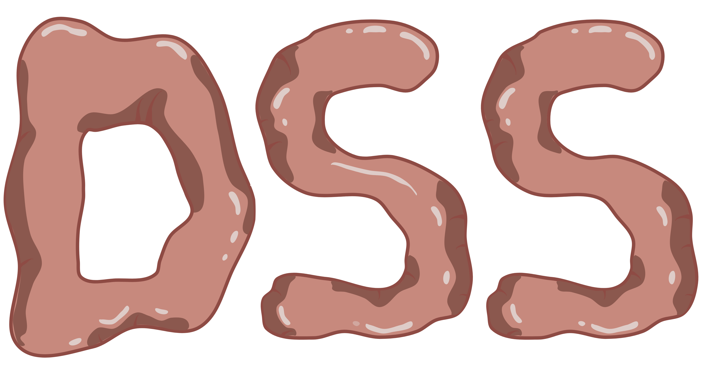
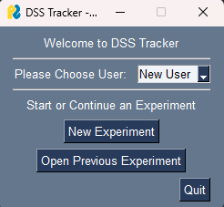
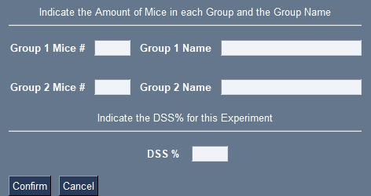
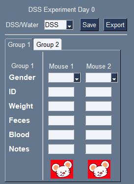
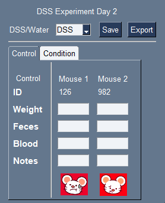
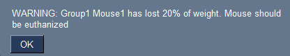
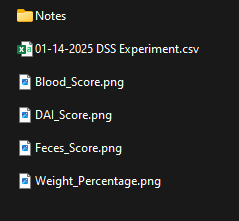

# DSS Tracker



User interface to track a DSS colitis experiment


# Installation

## About PySimpleGUI

Since version 5, PySimpleGUI has a free (Hobbyist) and paid (Commercial) option. 

Visit [PySimpleGUI GitHub](https://github.com/PySimpleGUI/PySimpleGUI) for more information and account creation. 

## Executable Option

For Windows users, an executable with PyInstaller was made. 
Download and unzip the file in the "Executable" folder.

Run .exe file.

## Individual Files

Download the folder "Download" and generate a command file to open with Python version 3.12.2.

An example script on Windows would look like the following:
```
call activate env
python main.py
```

In both cases, please don't move the location of the files.

# How to Use

## Starting an Experiment

After starting DSS Tracker, a welcome window will appear.



The first time, only "New User" will be available. Clicking on it will prompt you to create an user.

Click on "New Experiment" and indicate how many groups your experiment will have.

Afterward, indicate how many mice are in each group.

You can optionally name each group (e.g., "Control" or "Condition") and include the percentage of DSS used.
If you do not provide any of these values, default names (Group1, Group2, etc.) will be used, and the DSS value will be left empty.



After indicating the amount of mice per group you have, the experiment window will appear. Each Group will have its own tab.

On the first day (Day 0), you can indicate the Gender and Eartag (individual mice tracker). In the following days, this information will be shown but **won't be editable.**



Once finished, click on "Save" to save the experiment.
The experiment will be saved in a folder called "DSS Experiment" under a folder with the user name. The experiment is saved with the date of creation.

Now you can close the windows.

## Continuing an Experiment

The following day, select "Open Previous Experiment" and select your experiment folder. 

The folder should be in the same location as the main program: inside the DSS Experiment folder, under the user who created the experiment.
The pathways should look like the following:

`Folder_with_program/DSS Experiment/User_name/Folder_with_the_Experiment`

Add the new information and save to update your experiment



In case a mouse loses 18% or 20% of weight an alert will popup



### Euthanize Mouse

If you need to euthanize a mouse, add 0 to the weight of the mouse to be recorded as "Death". **This is irreversible**

### Inside your experiment folder

Your experiment folder has 2 folders: Experiment and Results

The Experiment folder will have a pickle file. 
The Results folder will have the graphs and .csv files when generated.

**WARNING** Do not rename the folders or the pickle file, as doing so will cause the program to fail.

## Getting Your Experiment Results

After saving the information from the last day, click on "Export".

You will find a .csv file with the results and the graph for all the conditions and the Disease Activity Index (DAI) in the Results folder.




### Notes Folder

For each mouse, there is a Note section, which will be exported into the "Notes" folder when exporting the experiment.

This is a free text section to save any extra information about the mouse that you consider relevant. 
Your notes and the date they were added will be saved.
There will be a .csv file for each mouse's notes.


